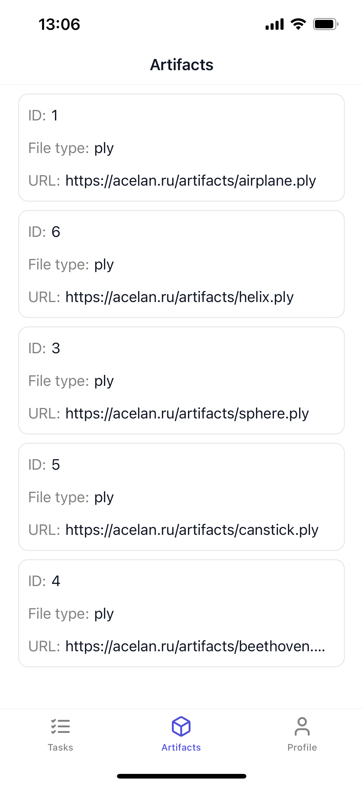
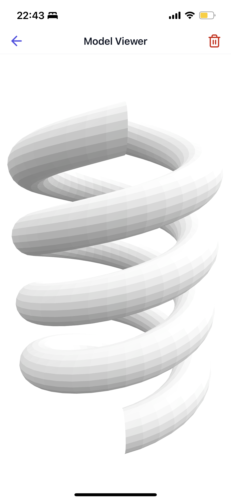

# Acelan Progress iOS

A mobile app to monitor calculation tasks

## Requirements

This app can be installed on iPhone with iOS version 14.0 or newer

## Key Features

- Tasks list
- Artifact downloads
- 3D model viewer

## Screenshots

         
